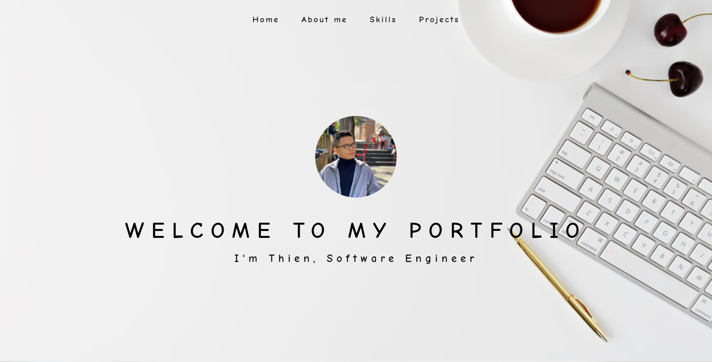
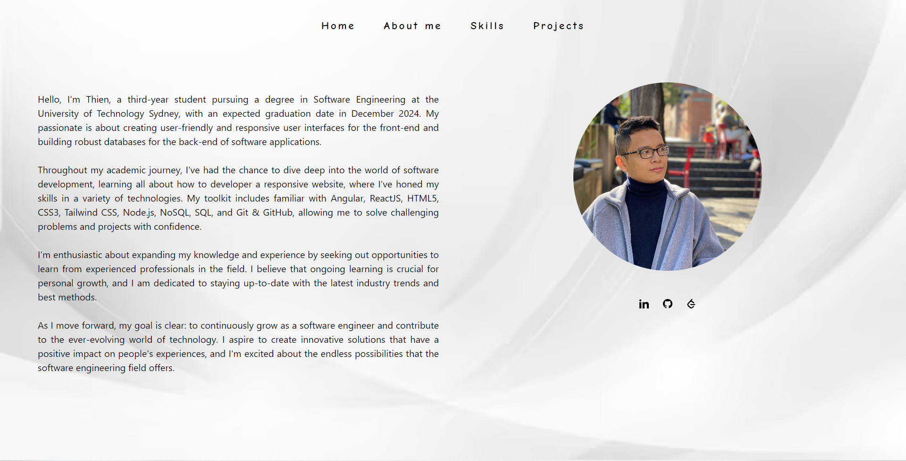
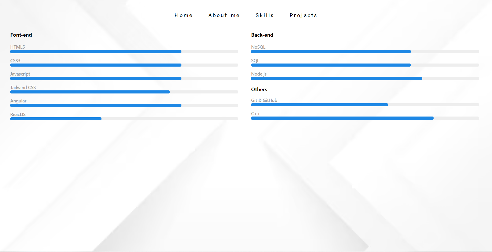

# My Portfolio

Hello and welcome to my Portfolio Website's repository! This site is all about sharing my work, skills, and story. I made it using ReactJS and styled it with Tailwind CSS, making it both fast and good-looking. Enjoy browsing!

# Features
- About Me: A brief introduction about who I am, my journey and social websites.
- Skills: A comprehensive list of my technical skills and expertise.
- Projects Showcase: Dive deep into some of the select projects I've worked on.

# Tech Stack
- Framework: ReactJS - for building user interfaces in a modular and scalable way.
- Styling: Tailwind CSS - a CSS framework for rapid UI development.

# Demo

